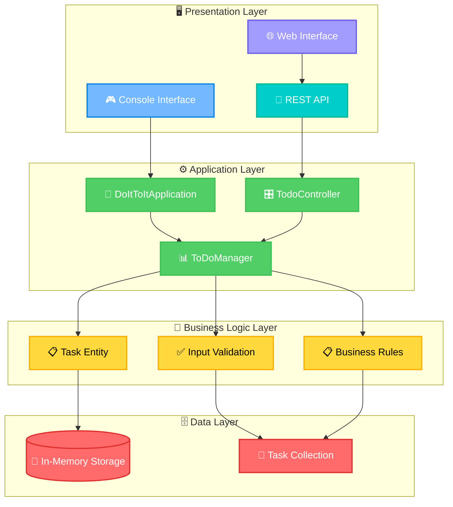

# ⚡ Do-It-To-It: Spring Boot Todo Management Console

*A powerful dual-mode Java application engineered for task management with both console and web interfaces, built on Spring Boot 3.5.5 and Java 21.*

---

## 🏅 Badges


---

## 📚 Table of Contents

- [⚡ Do-It-To-It: Spring Boot Todo Management Console](#-do-it-to-it-spring-boot-todo-management-console)
  - [🏅 Badges](#-badges)
  - [📚 Table of Contents](#-table-of-contents)
  - [🎯 Objective](#-objective)
  - [💡 Expected Benefit](#-expected-benefit)
  - [🚀 Features](#-features)
  - [🗂️ Project Structure](#️-project-structure)
  - [🧠 Architecture](#-architecture)
    - [🏗️ System Architecture Overview](#️-system-architecture-overview)
    - [📈 Application Flow Diagram](#-application-flow-diagram)
  - [⚙️ Installation](#️-installation)
  - [🚀 Usage](#-usage)
    - [Console Mode](#console-mode)
    - [Web Mode](#web-mode)
  - [🌐 API Endpoints](#-api-endpoints)
  - [📦 Dependencies](#-dependencies)
  - [📚 Examples](#-examples)
  - [🔧 Configuration](#-configuration)
  - [🔮 Future Improvements](#-future-improvements)
  - [🛠 Troubleshooting](#-troubleshooting)
  - [🤝 Contributing](#-contributing)
  - [📜 License](#-license)

---

## 🎯 Objective

Do-It-To-It enables developers and teams to manage tasks efficiently through a versatile Spring Boot application offering both **interactive console** and **modern web interfaces**. Built with industry-standard patterns and optimized for performance, it demonstrates enterprise-grade Java development while remaining lightweight and easily deployable.

---

## 💡 Expected Benefit

This application benefits **Java developers, project managers, and development teams** seeking a comprehensive task management solution. Do-It-To-It offers practical insights into **Spring Boot best practices, RESTful API design, and dual-interface architecture** while providing a production-ready foundation for enterprise task management systems. The codebase has been optimized to eliminate redundancies and follows clean architecture principles.

---

## 🚀 Features

### 🖥️ **Dual Interface Architecture**
- **Interactive Console Mode** – Rich command-line interface for terminal-based task management
- **Modern Web Interface** – Responsive HTML5/JavaScript frontend with real-time updates
- **Seamless Mode Switching** – Choose your preferred interface at runtime

### 📋 **Complete Task Management**
- **Full CRUD Operations** – Create, read, update, delete tasks with comprehensive validation
- **Status Tracking** – Pending, In Progress, Completed status management
- **Unique Task IDs** – Auto-generated identifiers for precise task management
- **Input Validation** – Robust error handling and data validation

### 🌐 **RESTful Web API**
- **REST Endpoints** – Complete API for external integrations
- **JSON Responses** – Standardized data exchange format
- **CORS Support** – Cross-origin requests enabled
- **Statistics API** – Real-time task analytics and metrics

### 🏗️ **Enterprise Architecture**
- **Spring Boot 3.5.5** – Latest stable framework with auto-configuration
- **Clean Architecture** – Separated concerns with controller, service, and model layers
- **Singleton Data Management** – Consistent data state across web and console modes
- **Maven Build System** – Dependency management and build automation
- **Optimized Project Structure** – Redundancy-free codebase with proper separation
- **Cross-Platform Ready** – Runs on Windows, macOS, and Linux

---

## 🗂️ Project Structure

```
Do-It-To-It/
├── do-it-to-it/
│   ├── src/
│   │   ├── main/
│   │   │   ├── java/
│   │   │   │   └── io/github/hillmatthew2000/do_it_to_it/
│   │   │   │       ├── DoItToItApplication.java    # Main application & console UI
│   │   │   │       ├── Task.java                   # Task entity model
│   │   │   │       ├── ToDoManager.java            # Core business logic
│   │   │   │       └── TodoController.java         # REST API controller
│   │   │   └── resources/
│   │   │       ├── application.properties          # Spring configuration
│   │   │       └── static/
│   │   │           └── index.html                  # Web interface
│   │   └── test/
│   │       └── java/
│   │           └── io/github/hillmatthew2000/do_it_to_it/
│   │               └── DoItToItApplicationTests.java
│   ├── target/                                     # Build artifacts (not tracked)
│   │   └── do-it-to-it-0.0.1-SNAPSHOT.jar
│   ├── pom.xml                                     # Maven configuration
│   ├── mvnw & mvnw.cmd                            # Maven wrapper scripts
│   ├── console.bat                                 # Console mode launcher
│   └── run.bat                                     # Web mode launcher
├── LICENSE
└── README.md
```

This structure implements **Spring Boot best practices** with clear separation between **presentation**, **business logic**, and **data models**, making the project scalable and maintainable. The project has been optimized to remove redundancies and follows clean architecture principles.

---

## 🧠 Architecture

### 🏗️ System Architecture Overview



### 📈 Application Flow Diagram

```mermaid
flowchart TD
    subgraph "🚀 Application Startup"
        Start[▶️ Application Start]:::startColor
        ModeCheck{🔍 Check Launch Mode}:::decisionColor
        ConsoleMode[🖥️ Console Mode]:::consoleColor
        SpringMode[🌐 Spring Boot Mode]:::springColor
    end
    subgraph "📋 Task Operations"
        UserInput[⌨️ User Input]:::inputColor
        Validation{✅ Validate Input}:::validationColor
        ProcessTask[⚙️ Process Task]:::processColor
        UpdateStorage[💾 Update Storage]:::storageColor
    end
    subgraph "📊 Response Handling"
        SuccessResponse[✅ Success Response]:::successColor
        ErrorResponse[❌ Error Response]:::errorColor
        UIUpdate[🔄 Update Interface]:::updateColor
    end
    
    Start --> ModeCheck
    ModeCheck -->|--spring flag| SpringMode
    ModeCheck -->|default| ConsoleMode
    ConsoleMode --> UserInput
    SpringMode --> UserInput
    UserInput --> Validation
    Validation -->|Valid| ProcessTask
    Validation -->|Invalid| ErrorResponse
    ProcessTask --> UpdateStorage
    UpdateStorage --> SuccessResponse
    SuccessResponse --> UIUpdate
    ErrorResponse --> UIUpdate
    
    classDef startColor fill:#00b894,stroke:#00a085,color:#fff
    classDef decisionColor fill:#fdcb6e,stroke:#e17055,color:#000
    classDef consoleColor fill:#74b9ff,stroke:#0984e3,color:#fff
    classDef springColor fill:#6c5ce7,stroke:#a29bfe,color:#fff
    classDef inputColor fill:#fd79a8,stroke:#e84393,color:#fff
    classDef validationColor fill:#ff6b6b,stroke:#e03131,color:#fff
    classDef processColor fill:#00cec9,stroke:#00b894,color:#fff
    classDef storageColor fill:#51cf66,stroke:#40c057,color:#fff
    classDef successColor fill:#00b894,stroke:#00a085,color:#fff
    classDef errorColor fill:#e03131,stroke:#d63031,color:#fff
    classDev updateColor fill:#a29bfe,stroke:#6c5ce7,color:#fff
```

---

## 🧹 Project Optimizations

This project has been thoroughly optimized to eliminate redundancies and improve maintainability:

### ✅ **Code Quality Improvements**
- **Singleton Data Management** – Fixed data isolation issues between web controller instances
- **Clean Maven Configuration** – Removed unnecessary empty XML elements from pom.xml
- **Optimized HTML Interface** – Fixed JavaScript references to non-existent properties
- **Consolidated Build Scripts** – Removed redundant batch files in favor of Maven wrapper

### 🗑️ **Removed Redundancies**
- **Empty Build Directory** – Eliminated unnecessary `build/` folder
- **Auto-generated Files** – Removed `HELP.md` that shouldn't be tracked
- **Duplicate Scripts** – Created focused batch files: `console.bat` and `run.bat` for specific modes
- **Unused XML Elements** – Cleaned up pom.xml structure

### 📊 **Performance Benefits**
- **Consistent Data State** – Web API and console mode now share data properly
- **Faster Build Times** – Streamlined Maven configuration
- **Reduced Project Size** – Eliminated unnecessary files and dependencies
- **Better User Experience** – Fixed web interface display issues

---

## ⚙️ Installation

> **⚠️ JAVA_HOME Issues? Use This Quick Fix:**
> 
> If you get "JAVA_HOME environment variable is not defined correctly" error:
> ```powershell
> # Navigate to project and use batch files instead:
> cd "C:\Do-It-To-It\do-it-to-it"
> cmd /c console.bat    # For console mode
> cmd /c run.bat        # For web mode
> ```
> These bypass JAVA_HOME requirements and get you running immediately!

### Prerequisites
- **Java 21** – [Download from Eclipse Adoptium](https://adoptium.net/) *(Required)*
- **JAVA_HOME** – Environment variable pointing to your JDK installation *(Required for Maven)*
- **Maven 3.6+** – Included via Maven Wrapper *(Automatic)*

### 🔍 **Environment Verification**

Before running the application, verify your Java setup:

```powershell
# Windows - Check Java installation and JAVA_HOME
java --version
echo $env:JAVA_HOME

# If JAVA_HOME is not set, set it:
setx JAVA_HOME "C:\Program Files\Eclipse Adoptium\jdk-21.0.8.9-hotspot"
# Then restart your terminal
```

```bash
# Linux/macOS - Check Java installation and JAVA_HOME
java --version
echo $JAVA_HOME

# If JAVA_HOME is not set, add to your shell profile:
export JAVA_HOME=/path/to/your/jdk
export PATH=$JAVA_HOME/bin:$PATH
```

### 🚀 Quick Start

```bash
# Clone the repository
git clone https://github.com/hillmatthew2000/Do-It-To-It.git
cd Do-It-To-It/do-it-to-it

# Option 1: Console mode with batch file (Windows - No JAVA_HOME required)
cmd /c console.bat

# Option 2: Console mode direct command (No JAVA_HOME required on Windows)
# Windows:
"C:\Program Files\Eclipse Adoptium\jdk-21.0.8.9-hotspot\bin\java.exe" -jar target/do-it-to-it-0.0.1-SNAPSHOT.jar
# Linux/macOS:
java -jar target/do-it-to-it-0.0.1-SNAPSHOT.jar

# Option 3: Web mode with batch file (Windows - No JAVA_HOME required)
cmd /c run.bat

# Option 4: Use Maven Wrapper (Requires JAVA_HOME)
./mvnw spring-boot:run

# Option 5: Build and run JAR manually
./mvnw clean package
java -jar target/do-it-to-it-0.0.1-SNAPSHOT.jar --spring
```

### 🪟 Windows Quick Commands

```powershell
# Navigate to project
cd "C:\Do-It-To-It\do-it-to-it"

# ⭐ CONSOLE MODE: Easy batch file (No JAVA_HOME required)
cmd /c console.bat

# 🌐 WEB MODE: Run with batch file (No JAVA_HOME required)  
cmd /c run.bat

# Manual command (Console Mode):
"C:\Program Files\Eclipse Adoptium\jdk-21.0.8.9-hotspot\bin\java.exe" -jar target/do-it-to-it-0.0.1-SNAPSHOT.jar

# Alternative: Run with Maven (requires JAVA_HOME to be set)
.\mvnw.cmd spring-boot:run
```

**💡 Available Batch Files:**
- **`console.bat`**: Launches console mode using full Java path (bypasses JAVA_HOME issues)
- **`run.bat`**: Launches web mode at http://localhost:8080 using full Java path

**💡 Console vs Web Mode:**
- **Console Mode**: Interactive command-line interface for task management
- **Web Mode**: Browser-based interface at http://localhost:8080

---

## 🚀 Usage

### Console Mode

### Console Mode

Launch the **interactive console interface**:

```powershell
# Windows - Easy way using batch file
cmd /c console.bat

# Windows - Direct command (console mode only)
"C:\Program Files\Eclipse Adoptium\jdk-21.0.8.9-hotspot\bin\java.exe" -jar target/do-it-to-it-0.0.1-SNAPSHOT.jar

# Or if you have JAVA_HOME set properly:
java -jar target/do-it-to-it-0.0.1-SNAPSHOT.jar

# Linux/macOS - Console mode only
java -jar target/do-it-to-it-0.0.1-SNAPSHOT.jar
```

**Features:**
- 🎨 **Rich menu-driven interface** with numbered options
- ⚡ **Real-time input validation** and error handling
- 📋 **Complete task lifecycle** management
- 🔍 **Interactive task selection** and updates

### Web Mode

Launch the **Spring Boot web application**:

```bash
./mvnw spring-boot:run
# or
java -jar target/do-it-to-it-0.0.1-SNAPSHOT.jar --spring
```

**Access points:**
- 🌐 **Web Interface**: [http://localhost:8080](http://localhost:8080)
- 🔌 **REST API**: [http://localhost:8080/api/todos](http://localhost:8080/api/todos)
- 📊 **Statistics**: [http://localhost:8080/api/todos/stats](http://localhost:8080/api/todos/stats)

**Web Features:**
- ✨ **Modern responsive design** with intuitive UI
- 📊 **Real-time statistics** dashboard
- ⚡ **Instant updates** without page refresh
- 🎯 **One-click task actions** (complete, delete)

---

## 🌐 API Endpoints

| Method | Endpoint | Description | Example |
|--------|----------|-------------|---------|
| **GET** | `/api/todos` | Get all tasks | `curl http://localhost:8080/api/todos` |
| **GET** | `/api/todos/{id}` | Get specific task | `curl http://localhost:8080/api/todos/1` |
| **POST** | `/api/todos` | Create new task | `curl -X POST -H "Content-Type: application/json" -d '{"description":"Learn Spring Boot"}' http://localhost:8080/api/todos` |
| **PUT** | `/api/todos/{id}` | Update task description | `curl -X PUT -H "Content-Type: application/json" -d '{"description":"Updated task"}' http://localhost:8080/api/todos/1` |
| **PATCH** | `/api/todos/{id}/complete` | Mark task completed | `curl -X PATCH http://localhost:8080/api/todos/1/complete` |
| **DELETE** | `/api/todos/{id}` | Delete task | `curl -X DELETE http://localhost:8080/api/todos/1` |
| **GET** | `/api/todos/stats` | Get statistics | `curl http://localhost:8080/api/todos/stats` |

---

## 📦 Dependencies

This project leverages these carefully selected technologies:

| Dependency | Version | Purpose |
|------------|---------|---------|
| **Spring Boot Starter Web** | `3.5.5` | Web framework and embedded Tomcat |
| **Spring Boot DevTools** | `3.5.5` | Development-time productivity tools |
| **Spring Boot Starter Test** | `3.5.5` | Testing framework integration |
| **Java** | `21` | Modern Java platform with latest features |
| **Maven** | `3.6+` | Build automation and dependency management |

---

## 📚 Examples

### 🖥️ Console Interface Examples

```
Welcome to the Java To-Do App!
================================

Choose an option:
1. Add Task
2. List Tasks
3. Update Task
4. Delete Task
5. Mark Task Completed
6. Exit
> 1

Enter task description: Implement REST API endpoints
Task added with ID 1.

> 2

--- Your Tasks ---
ID: 1 | Description: Implement REST API endpoints | Status: Pending
Total tasks: 1
```

### 🌐 Web Interface Examples

**Creating a task via Web UI:**
1. Open [http://localhost:8080](http://localhost:8080)
2. Enter task description in the input field
3. Click "Add Task" or press Enter
4. See instant feedback and updated task list

**API Usage Examples:**

```bash
# Create a new task
curl -X POST -H "Content-Type: application/json" \
  -d '{"description":"Deploy to production"}' \
  http://localhost:8080/api/todos

# Response:
{
  "message": "Task created successfully",
  "taskId": 1,
  "task": {
    "id": 1,
    "description": "Deploy to production",
    "status": "Pending"
  }
}

# Get all tasks
curl http://localhost:8080/api/todos

# Mark task as completed
curl -X PATCH http://localhost:8080/api/todos/1/complete

# Get statistics
curl http://localhost:8080/api/todos/stats
# Response: {"totalTasks":3,"completedTasks":1,"pendingTasks":2}
```

---

## 🔧 Configuration

### Application Properties

```properties
# Spring Boot configuration
spring.application.name=do-it-to-it

# Note: Default server.port=8080 (Spring Boot default)
# Note: DevTools auto-configuration enabled via Maven dependency
```

### Build Configuration

**Maven Configuration (pom.xml):**
- ✅ **Spring Boot 3.5.5** with Java 21 compatibility
- ✅ **Web Starter** for REST APIs and static content
- ✅ **DevTools** for development productivity
- ✅ **Test Starter** for comprehensive testing
- ✅ **Executable JAR** generation with embedded Tomcat

### Runtime Modes

**Console Mode** (default):
```bash
java -jar do-it-to-it-0.0.1-SNAPSHOT.jar
```

**Web Mode** (Spring Boot):
```bash
java -jar do-it-to-it-0.0.1-SNAPSHOT.jar --spring
# or
./mvnw spring-boot:run
```

---

## 🔮 Future Improvements

**Planned Enhancements:**

### 🗄️ **Data Persistence**
- ⭐ **Database Integration** (H2, PostgreSQL, MySQL support)
- ⭐ **JPA/Hibernate** entity mapping and relationships
- ⭐ **Data Migration** scripts and version control
- ⭐ **Backup & Restore** functionality

### 🔐 **Security & Authentication**
- ⭐ **Spring Security** integration
- ⭐ **JWT Authentication** for API access
- ⭐ **User Management** with role-based access
- ⭐ **OAuth2 Integration** (Google, GitHub, Microsoft)

### 📱 **Enhanced User Experience**
- ⭐ **Progressive Web App (PWA)** capabilities
- ⭐ **Mobile-Responsive Design** improvements
- ⭐ **Dark/Light Theme** toggle
- ⭐ **Keyboard Shortcuts** and accessibility features

### 🚀 **Advanced Features**
- ⭐ **Task Categories & Tags** for organization
- ⭐ **Due Dates & Reminders** with notifications
- ⭐ **Task Priorities** and sorting options
- ⭐ **File Attachments** and rich text descriptions
- ⭐ **Team Collaboration** and task sharing

### 🧪 **Testing & Quality**
- ⭐ **Comprehensive Unit Tests** with JUnit 5
- ⭐ **Integration Tests** for API endpoints
- ⭐ **Performance Testing** and load testing
- ⭐ **Code Coverage** reporting with JaCoCo
- ✅ **Code Quality Optimization** – Removed redundancies and improved architecture

### ☁️ **Deployment & DevOps**
- ⭐ **Docker Containerization** for easy deployment
- ⭐ **CI/CD Pipeline** with GitHub Actions
- ⭐ **Cloud Deployment** (AWS, Azure, GCP)
- ⭐ **Monitoring & Logging** with Actuator and Micrometer

---

## 🛠 Troubleshooting

### Common Issues & Solutions

**`java: command not found`**
- ✅ Install [Java 21 from Eclipse Adoptium](https://adoptium.net/)
- ✅ Ensure Java is added to your system PATH
- ✅ Verify installation: `java --version`

**`JAVA_HOME environment variable is not defined correctly`**
- ✅ **Windows**: Set JAVA_HOME to your JDK installation path
  ```powershell
  # Find your Java installation
  where java
  
  # Set JAVA_HOME (example path - adjust to your installation)
  setx JAVA_HOME "C:\Program Files\Eclipse Adoptium\jdk-21.0.8.9-hotspot"
  
  # Restart PowerShell/Command Prompt after setting
  ```
- ✅ **Linux/macOS**: Add to your shell profile (.bashrc, .zshrc, etc.)
  ```bash
  export JAVA_HOME=/path/to/your/jdk
  export PATH=$JAVA_HOME/bin:$PATH
  ```
- ✅ **Alternative**: Use the full Java path directly
  ```powershell
  # Windows - use full path in run.bat or direct execution
  "C:\Program Files\Eclipse Adoptium\jdk-21.0.8.9-hotspot\bin\java.exe" -jar target/do-it-to-it-0.0.1-SNAPSHOT.jar --spring
  ```

**`mvnw: permission denied` (Linux/macOS)**
- ✅ Make Maven wrapper executable: `chmod +x mvnw`
- ✅ Alternative: Use system Maven: `mvn spring-boot:run`

**Port 8080 already in use**
- ✅ Check running processes: `netstat -tlnp | grep 8080`
- ✅ Kill conflicting process or change port in `application.properties`
- ✅ Use different port: `./mvnw spring-boot:run -Dserver.port=8081`

**Build fails with dependency errors**
- ✅ Clear Maven cache: `./mvnw clean`
- ✅ Force dependency refresh: `./mvnw clean install -U`
- ✅ Check internet connection for dependency downloads

**Console mode not working**
- ✅ Ensure you're running without the `--spring` flag
- ✅ Check terminal encoding supports UTF-8
- ✅ For Windows: Use Command Prompt or PowerShell

**Web interface shows empty page**
- ✅ Verify Spring Boot started correctly (check console logs)
- ✅ Access [http://localhost:8080](http://localhost:8080) directly
- ✅ Check browser developer tools for JavaScript errors
- ✅ Clear browser cache and reload

### Performance Optimization

**For large task lists:**
- 📊 Current implementation uses in-memory storage
- ⚡ Suitable for hundreds of tasks
- 🔮 Database integration planned for enterprise scale

**Memory usage:**
- 💾 Typical usage: 50-100MB RAM
- ⚡ Startup time: 2-5 seconds
- 🔧 JVM tuning: `-Xmx512m` for larger datasets

---

## 🤝 Contributing

We welcome contributions from developers of all skill levels! 

### 🚀 Getting Started
1. **Fork** the repository: [Do-It-To-It on GitHub](https://github.com/hillmatthew2000/Do-It-To-It)
2. **Clone** your fork: `git clone https://github.com/yourusername/Do-It-To-It.git`
3. **Create** a feature branch: `git checkout -b feature/amazing-feature`
4. **Make** your changes and commit: `git commit -m 'Add amazing feature'`
5. **Push** to your branch: `git push origin feature/amazing-feature`
6. **Open** a Pull Request with detailed description

### 📋 Development Guidelines
- 🎯 **Follow Java 21 conventions** and Spring Boot best practices
- 📏 **Keep methods focused** (preferably under 50 lines)
- 📝 **Write JavaDoc** for public classes and methods
- ✅ **Include tests** for new functionality
- 🧹 **Format code** consistently (use IDE auto-formatting)

### 🔍 Areas for Contribution
- 🐛 **Bug fixes** and performance improvements
- 📚 **Documentation** and code examples
- 🧪 **Test coverage** expansion
- 🚀 **New features** from the roadmap
- 🌐 **UI/UX** improvements and accessibility
- 🔧 **Build and deployment** enhancements

### 🧪 Running Tests
```bash
# Run all tests
./mvnw test

# Run with coverage
./mvnw test jacoco:report

# Run integration tests
./mvnw verify
```

---

## 📜 License

This project is licensed under the **MIT License** - see the [LICENSE](LICENSE) file for details.

```
MIT License © 2025 Matthew Hill
```

**What this means:**
- ✅ **Commercial use** allowed
- ✅ **Modification** allowed  
- ✅ **Distribution** allowed
- ✅ **Private use** allowed
- ❌ **Liability and warranty** disclaimers apply

---

## 🎉 Acknowledgments

- 🍃 **Spring Boot Team** for the excellent framework
- ☕ **OpenJDK Community** for Java 21 innovations
- 🛠️ **Maven Project** for build automation
- 💡 **Open Source Community** for inspiration and best practices

---

*Built with ❤️ using Java 21, Spring Boot 3.5.5, and modern web technologies. Optimized for performance and maintainability.*

---

## 📞 Contact & Support

- **GitHub Repository**: [https://github.com/hillmatthew2000/Do-It-To-It](https://github.com/hillmatthew2000/Do-It-To-It)
- **Issues & Bug Reports**: [GitHub Issues](https://github.com/hillmatthew2000/Do-It-To-It/issues)
- **Feature Requests**: [GitHub Discussions](https://github.com/hillmatthew2000/Do-It-To-It/discussions)

**Happy coding! 🚀**